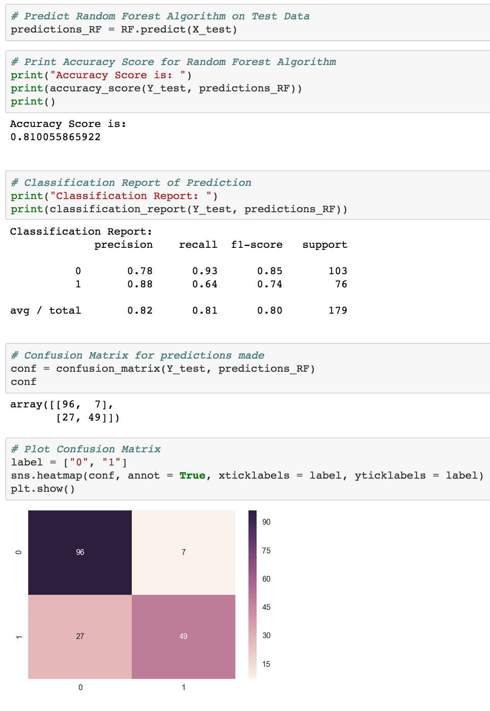
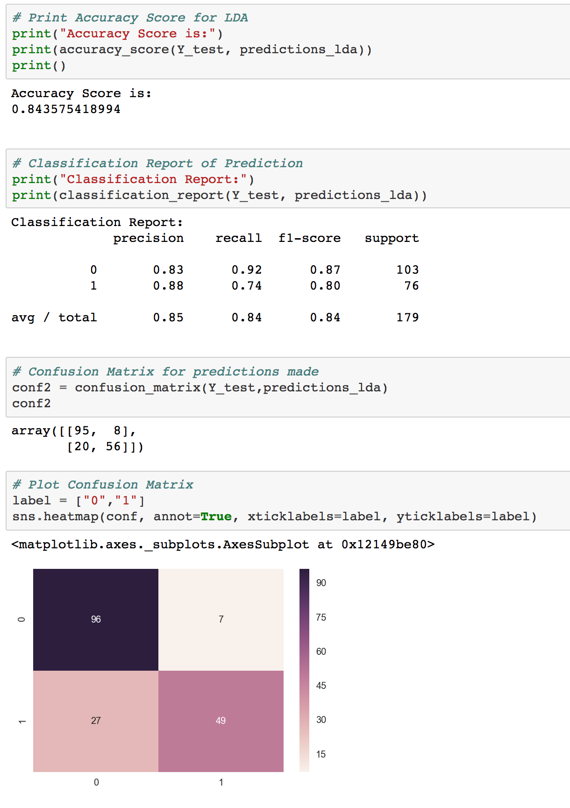

# TITANIC_ANALYSIS

This repository contains an analysis done on the famous TITANIC ship wreck dataset available on kaggle.

Details of files contained in this repository:
* titanic_train.csv: This is the file which contitues the dataset.

* titanic-data-analysis.iypnb/html: These are the Jupyter notebook and the HTML file of the analysis which has been done.

There are various detailed graphs and charts in the notebook and the HTMl file pertaining to the analysis of the wreck.

I have used two models, namely:

  1) Random Forest Classification Algorithm.
  2) Linear Discrimination Analysis.

##Random Forest Classification Algorithm - Implementation and Results:

  

##Linear Discrimination Analysis - Implementation and Results:

 
